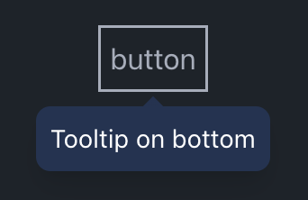

# React tailwind tooltip

React tailwind tooltip is a React component for creating customizable tooltips using Tailwind CSS. It provides flexibility in tooltip placement, appearance, and behavior, making it easy to enhance user interfaces with informative tooltips.


[](./LICENSE)

## Installation:

[](https://www.npmjs.com/package/react-tailwind-tooltip)

Install with npm:

`npm install react-tailwind-tooltip`

Install with yarn:

`yarn add react-tailwind-tooltip`

Install with pnpm:

`pnpm add react-tailwind-tooltip`

## License

This project is licensed under the MIT License - see the [LICENSE](LICENSE) file for details.

## Repository

For more information, issues, and contributions, visit the [GitHub repository](https://github.com/Ramziij/react_tailwind_tooltip).

## Example Usage:



```tsx
import React from 'react';
import { Tooltip } from 'react-tailwind-tooltip';

const App = () => {
  return (
    <div className="p-6">
      <Tooltip title="This is a tooltip!" placement="top" arrow>
        <button className="px-4 py-2 bg-blue-500 text-white rounded">Hover me</button>
      </Tooltip>
    </div>
  );
};

export default App;
```

You can also insert styles - `import 'react-tailwind-tooltip/dist/index.css'`

### Properties

| Name            | Type                                                            | Description                                                          |
| --------------- | --------------------------------------------------------------- | -------------------------------------------------------------------- |
| `children`      | `React.ReactNode`                                               | The element that the tooltip will be attached to.                    |
| `title`         | `React.ReactNode`                                               | The content of the tooltip.                                          |
| `placement*`    | `top \| bottom \| left \| right`                                | TThe preferred position of the tooltip. Default `bottom`             |
| `followCursor*` | `boolean`                                                       | Whether the tooltip should follow the cursor. Default `false`        |
| `arrow*`        | `boolean`                                                       | Whether to display an arrow pointing to the element. Default `false` |
| `open*`         | `boolean`                                                       | Control the visibility of the tooltip.                               |
| `tooltipStyle*` | `string`                                                        | Style of the tooltip. Default `bg-[#223354]/95 text-white text-sm`   |
| `arrowStyle*`   | `string`                                                        | Style of the arrow. Default `to-[#223354]/95`                        |
| `enterDelay*`   | `number`                                                        | Delay in milliseconds before the tooltip appears. Default `300`      |
| `leaveDelay*`   | `number`                                                        | Delay in milliseconds before the tooltip disappears. Default `300`   |
| `onOpen*`       | `(event: React.MouseEvent<HTMLDivElement, MouseEvent>) => void` | Callback function triggered when the tooltip opens.                  |
| `onClose*`      | `(event: React.MouseEvent<HTMLDivElement, MouseEvent>) => void` | Callback function triggered when the tooltip closes.                 |

Props marked with \* are not required.
